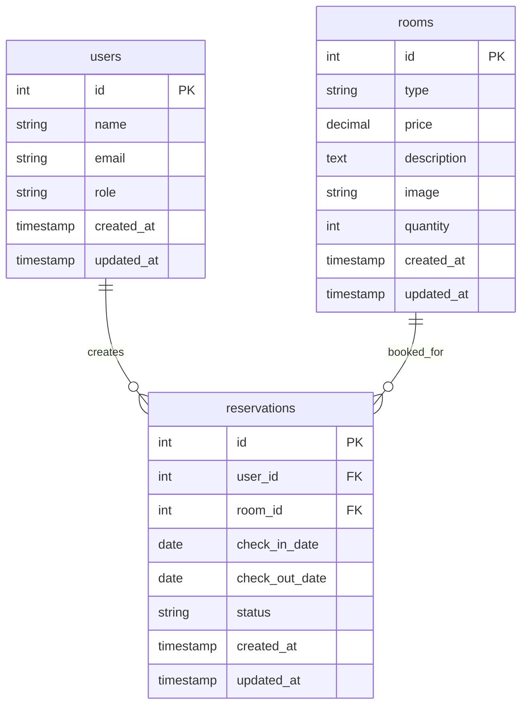

# CallMeHotel - Hotel Reservation System

<p align="center">
  
</p>

<p align="center">
  <strong>A comprehensive hotel reservation web application built with Laravel 12, Vite, and Tailwind CSS</strong>
</p>

<p align="center">
  
  
  
  
  
</p>

---

## 📋 Table of Contents

- [About the Project](#-about-the-project)
- [Screenshots](#-screenshots)
- [Key Features](#-key-features--workflows)
- [User Roles & Permissions](#-user-roles--permissions)
- [Technology Stack](#-technology-stack)
- [Application Security](#-application-security)
- [Prerequisites](#-prerequisites)
- [Installation Guide](#-installation-guide)
- [Environment Configuration](#-environment-configuration)
- [Running the Application](#-running-the-application)
- [Database Structure](#-database-structure--project-organization)
- [About the Developer](#-about-the-developer)
- [License](#-license)

---

## 🏨 About the Project

**CallMeHotel** is a full-stack web application developed as a final project for the **Web Programming Workshop** course. This application simulates a modern hotel reservation system, featuring a dynamic and responsive user interface for guests and a comprehensive management panel for administrators and hotel staff.

### 🎯 Project Objectives

This project demonstrates the implementation of modern web development concepts, including:

- **MVC Architecture** (Model-View-Controller)
- **Multi-role Authentication System** with role-based access control
- **CRUD Operations** for comprehensive data management
- **Relational Database** implementation with Eloquent ORM
- **Modern Asset Bundling** with Vite for optimized performance

---

## 📸 Screenshots

Here are some previews of the CallMeHotel application interface:

> **Note:** Replace `YOUR_IMAGE_LINK` below with the actual path to your screenshots after uploading them to the repository (e.g., `public/screenshots/`).

<table>
  <tr>
    <td align="center"><strong>🏠 Landing Page</strong></td>
    <td align="center"><strong>👑 Admin Dashboard</strong></td>
  </tr>
  <tr>
    <td></td>
    <td></td>
  </tr>
  <tr>
    <td align="center"><strong>👥 Staff Dashboard</strong></td>
    <td align="center"><strong>👤 Customer Dashboard</strong></td>
  </tr>
   <tr>
    <td></td>
    <td></td>
  </tr>
  <tr>
    <td align="center"><strong>🛏️ Room Details</strong></td>
    <td align="center"><strong>🔧 Room Management (Admin)</strong></td>
  </tr>
   <tr>
    <td></td>
    <td></td>
  </tr>
</table>

---

## ⭐ Key Features & Workflows

The application provides comprehensive features designed to serve different types of users, from guests to system administrators.

### 🌟 Features by User Role

#### 🌐 Public Features (All Users)
- **Homepage**: Main landing page showcasing featured rooms and hotel services
- **Room Gallery**: Browse all available room types with pricing and brief descriptions
- **Room Details**: Detailed information for each room type, including full descriptions and availability
- **Static Pages**: "About Us" and "Contact" pages with information and contact forms
- **Authentication**: User registration and login functionality

#### 👤 Customer Features
- **Personal Dashboard**: View complete reservation history with status tracking
- **Advanced Filtering**: Filter reservation history by status and sort by date
- **Profile Management**: Update personal information, email, and password
- **Room Booking**: Submit reservation requests with automatic availability validation

#### 👥 Staff Features
- **Operational Dashboard**: Daily operational summary including pending reservations and today's check-ins/check-outs
- **Reservation Management**: View and manage all customer reservations with advanced filtering
- **Status Updates**: Primary staff function to update reservation status (Pending → Confirmed/Cancelled)

#### 👑 Admin Features
*(Includes all Staff features plus):*
- **Analytics Dashboard**: Business analytics including total revenue, new customers, and trend visualizations
- **Room Management (CRUD)**: Complete room management including adding, editing, deleting, and image uploads
- **User Management (CRUD)**: Manage all users and staff, change roles, and account administration

### 🔄 Feature Workflows

#### Customer Booking Process
1. **Authentication** → User login/registration
2. **Room Browse** → Navigate to "Rooms" page
3. **Room Selection** → Click "View Details" on desired room
4. **Date Selection** → Fill check-in and check-out dates
5. **Reservation Request** → Submit booking request
6. **Validation** → System validates dates and availability
7. **Confirmation** → Reservation created with "Pending" status
8. **Dashboard View** → User redirected to dashboard to view new reservation

#### Staff Reservation Management
1. **Staff Login** → Access staff dashboard
2. **Notification Review** → View pending reservations
3. **Reservation Management** → Navigate to reservation management page
4. **Status Update** → Select "Confirmed" from dropdown for valid reservations
5. **System Update** → Database updated, customer notified of confirmation

#### Admin User Role Management
1. **Admin Login** → Access admin dashboard
2. **User Management** → Navigate to "User Management" or "Staff Management" in sidebar
3. **User Review** → View user list with action buttons (buttons hidden for admin accounts for security)
4. **Role Edit** → Click "Edit Role" link for target user
5. **Role Selection** → Choose new role ('user' or 'staff') from dropdown
6. **Role Update** → Click "Update Role" button
7. **System Validation** → System validates and updates user `role` column in database
8. **Confirmation** → Admin redirected to user list with success message

---

## 🔐 User Roles & Permissions

The application implements **Role-Based Access Control (RBAC)** to restrict functionality based on user type.

| Role | Description | Primary Permissions | Middleware |
|:-----|:------------|:-------------------|:-----------|
| **👑 Admin** | Highest privilege user with complete system control | Analytics dashboard, Room CRUD, User CRUD, All reservations | `AdminMiddleware.php` |
| **👥 Staff** | Operational user responsible for daily reservation management | Operational dashboard, View all reservations, **Update reservation status** | `StaffMiddleware.php` |
| **👤 User** | Registered customer who can make reservations | Create reservations, View personal history, Profile management | `auth` (Laravel Default) |

---

## 🛠️ Technology Stack

### Backend Technologies
- **PHP** `^8.2` - Server-side programming language
- **Laravel Framework** `^12.0` - PHP web application framework
- **MySQL** `8.0` - Primary database management system
- **Eloquent ORM** - Database interaction layer
- **Laravel Breeze** - Authentication starter kit

### Frontend Technologies
- **Vite** - Modern build tool for fast asset compilation
- **Tailwind CSS** - Utility-first CSS framework for responsive design
- **Alpine.js** - Lightweight JavaScript framework for interactivity
- **Chart.js** - Data visualization library for admin dashboard
- **Font Awesome** - Icon library for admin and staff panels

### Development Environment
- **Laragon** - Integrated local server environment (Apache/Nginx, MySQL, PHP)
- **Composer** - PHP dependency manager
- **NPM/Yarn** - Frontend package manager
- **Laravel Pint** - PHP code style fixer
- **Laravel Pail** - Interactive logging tool

---

## 🔒 Application Security

This project implements several standard web security practices provided by Laravel to protect data and users.

### 🛡️ Security Features

- **CSRF Protection (Cross-Site Request Forgery)**: All forms performing `POST`, `PUT`, `PATCH`, or `DELETE` actions are protected by CSRF tokens using the `@csrf` Blade directive in every form.

- **Server-Side Validation**: All user-submitted data through forms (registration, contact, data creation) is strictly validated server-side using **Laravel Validator**. This prevents invalid or potentially harmful data from entering the system.

- **SQL Injection Protection**: By using Eloquent ORM and Laravel's Query Builder, all database interactions automatically use **prepared statements**, effectively preventing SQL Injection attacks.

- **Password Hashing**: User passwords are never stored as plain text. All passwords are securely hashed using **Bcrypt** during registration and updates. Password verification during login is performed against the hashed value, not plain text.

- **Route Protection with Middleware**: Sensitive routes for Admin and Staff are protected by custom middleware (`AdminMiddleware` and `StaffMiddleware`). These middleware check user roles before granting access and redirect unauthorized users.

- **Output Escaping (XSS Protection)**: Blade template engine automatically escapes all data displayed using `{{ }}` syntax by default. This helps prevent **Cross-Site Scripting (XSS)** attacks by ensuring no malicious scripts are executed on the client side.

---

## 📋 Prerequisites

Ensure you have the following software installed on your development machine:

### Required Software
- **Laragon** - The easiest way to run this project (includes Apache/Nginx, MySQL, and PHP)
- **Composer** - PHP dependency manager (accessible via terminal)
- **Node.js** - LTS version (v18 or v20 recommended) with NPM or Yarn

### System Requirements
- **PHP** 8.2 or higher
- **MySQL** 8.0 or higher
- **Node.js** 18+ with NPM

---

## 🚀 Installation Guide

Follow these step-by-step instructions to install and run the project in your local development environment using Laragon.

### Step 1: Clone the Repository
Open terminal in your Laragon `htdocs` or `www` directory:
```bash
git clone https://github.com/CallMeFG/callmehotel.git
cd callmehotel
```

### Step 2: Install PHP Dependencies
```bash
composer install
```

### Step 3: Install Frontend Dependencies
```bash
npm install
```

### Step 4: Environment Configuration
```bash
cp .env.example .env
```

### Step 5: Database Setup
1. Ensure Apache & MySQL services are running in Laragon
2. Open HeidiSQL or your preferred database tool
3. Create a new database named `callmehotel`
4. Configure your `.env` file (see [Environment Configuration](#-environment-configuration))

### Step 6: Generate Application Key
```bash
php artisan key:generate
```

### Step 7: Run Migrations and Seeders
```bash
php artisan migrate --seed
```

### Step 8: Create Storage Symbolic Link
```bash
php artisan storage:link
```

### Step 9: Build Frontend Assets
```bash
npm run build
```

🎉 **Installation Complete!** Your application is now ready to run.

---

## ⚙️ Environment Configuration

Configure your `.env` file with the following key variables:

| Variable | Example Value | Description |
|:---------|:-------------|:------------|
| `APP_NAME` | `"CallMeHotel"` | Application name displayed in titles |
| `APP_URL` | `http://callmehotel.test` | Base URL (match your Laragon configuration) |
| `DB_CONNECTION` | `mysql` | Database connection type |
| `DB_DATABASE` | `callmehotel` | Database name created in Step 5 |
| `DB_USERNAME` | `root` | Database username (usually `root` for Laragon) |
| `DB_PASSWORD` | `` | Database password (usually empty for Laragon) |

> **Note:** Other variables like `SESSION_DRIVER`, `CACHE_STORE`, and `QUEUE_CONNECTION` are preconfigured to use `database` drivers.

---

## 🏃‍♂️ Running the Application

### Recommended Method (Using Development Script)

The project includes a custom script that runs all necessary services simultaneously:

```bash
composer dev
```

This command automatically starts:
- PHP development server (`php artisan serve`)
- Queue worker for background tasks (`php artisan queue:listen`)
- Real-time log monitoring (`php artisan pail`)
- Vite development server with HMR (`npm run dev`)

### Accessing the Application

Once the server is running, open your browser and visit the URL configured in your `.env` file (e.g., `http://callmehotel.test`).

### 🔑 Default Accounts

The system comes pre-seeded with test accounts for easy testing:

| Role | Email | Password |
|:-----|:------|:---------|
| 👑 **Admin** | `admin@callmehotel.test` | `password` |
| 👥 **Staff** | `staff@callmehotel.test` | `password` |
| 👤 **Customer** | `test@example.com` | `password` |

---

## 🗄️ Database Structure & Project Organization

### Database Schema

The database structure is defined in migration files located in `database/migrations`, with relationships managed through Eloquent ORM.

#### Core Tables
- **`users`** - User data including name, email, and role (admin/staff/user)
- **`rooms`** - Room types with pricing, descriptions, images, and quantity
- **`reservations`** - Core transaction table linking users and rooms with booking details

#### Laravel System Tables
- `sessions`, `cache`, `jobs`, `failed_jobs` - Laravel functional tables

### Entity Relationship Diagram



### Project Structure Overview

```
callmehotel/
├── 📁 app/
│   ├── 📁 Http/
│   │   ├── 📁 Controllers/     # Business logic controllers (Admin, Staff, Auth)
│   │   ├── 📁 Middleware/      # Custom middleware (AdminMiddleware, StaffMiddleware)
│   │   └── 📁 Requests/        # Form request validation classes
│   ├── 📁 Models/              # Eloquent models (User, Room, Reservation)
│   ├── 📁 Providers/           # Service providers
│   └── 📁 View/                # View composers and creators
├── 📁 bootstrap/               # Framework bootstrap files
├── 📁 config/                  # Configuration files
├── 📁 database/
│   ├── 📁 factories/           # Model factories for testing
│   ├── 📁 migrations/          # Database schema definitions
│   └── 📁 seeders/             # Initial data seeders
├── 📁 node_modules/            # Frontend dependencies
├── 📁 public/                  # Public assets and entry point
├── 📁 resources/
│   ├── 📁 css/                 # Stylesheets (app.css)
│   ├── 📁 js/                  # JavaScript files (app.js)
│   └── 📁 views/               # Blade templates organized by role
├── 📁 routes/                  # Route definitions (web.php, auth.php)
├── 📁 storage/
│   ├── 📁 app/                 # Application storage
│   ├── 📁 framework/           # Framework cache and sessions
│   └── 📁 logs/                # Application logs
├── 📁 tests/
│   ├── 📁 Feature/             # Feature tests
│   ├── 📁 Unit/                # Unit tests
│   └── 📄 TestCase.php         # Base test case
├── 📁 vendor/                  # Composer dependencies
└── 📄 vite.config.js           # Vite configuration
```

---

## 👨‍💻 About the Developer

This project was designed, developed, and maintained by **Fathur Rizky Assani** as a final project for the Web Programming Workshop course.

### 📱 Connect With Me

<p align="left">
  <a href="https://github.com/CallMeFG/" target="_blank">
    
  </a>
  <a href="https://www.linkedin.com/in/fathur-rizky-assani" target="_blank">
    
  </a>
  <a href="https://x.com/RizkyAs_Dev" target="_blank">
    
  </a>
  <a href="https://www.instagram.com/rzky.sn_/" target="_blank">
    
  </a>
</p>

---

## 📄 License

This project is distributed under the **MIT License**. See the `LICENSE` file for more information.

[](https://choosealicense.com/licenses/mit/)

---

## 📝 Additional Notes

### 🎨 Custom Design Implementation
- Built upon **Laravel Breeze** authentication foundation
- Extensively customized frontend layouts and admin/staff panels
- Unique and integrated user experience design

### 🗃️ Database Dependencies
- Core Laravel functionality (Session, Cache, Queue) configured to use `database` drivers
- Running migrations is essential for both application and Laravel system tables

### ⚠️ Error Handling
- Controllers include `try-catch` blocks for common exceptions
- Data integrity protection (e.g., preventing room deletion with existing reservations)

### 🔄 Project Status
**✅ Completed** - This project is considered complete as a Final Project. No new feature development planned, but bug fixes may be implemented if discovered.

---

<p align="center">
  <strong>Built with ❤️ using Laravel, Tailwind CSS, and modern web technologies</strong>
</p>
